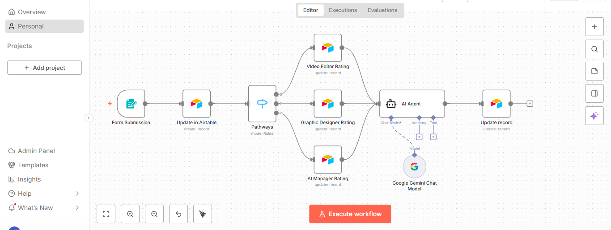

# Role-Based AI Automation (n8n)

This repository showcases a **role-based AI automation workflow built using n8n**, combining conditional logic, structured data handling, and generative AI to demonstrate how AI agents can be embedded into real-world automation pipelines.

The project highlights how traditional decision-based workflows can be enhanced with AI to produce intelligent, creative, and automated outcomes.

---

## Overview

This workflow automates the following process:

- Collects structured user input via an n8n form  
- Stores and manages data in Airtable  
- Routes execution based on user roles  
- Assigns role-specific ratings automatically  
- Uses a generative AI agent to create personalized content  
- Updates records with AI-generated output  

The focus of this project is **AI orchestration**, not just AI inference.

---

## Workflow Architecture



---

## Workflow Steps

### 1. Form Submission
Users submit details through an n8n form:
- Name  
- Looks  
- Profession (Video Editor, Graphic Designer, AI Manager)

### 2. Data Persistence
All submissions are stored in Airtable, ensuring a reliable data layer for automation and enrichment.

### 3. Role-Based Routing
A switch node routes the workflow based on the selected profession:
- Video Editor → Rating: 4  
- Graphic Designer → Rating: 3  
- AI Manager → Rating: 5  

### 4. AI Agent Execution
A generative AI agent powered by **Google Gemini** generates a simple, two-line poem using:
- Name  
- Looks  
- Profession  

### 5. Record Enrichment
The AI-generated poem is written back to Airtable, enriching the original record with creative AI output.

---

## Tech Stack

- n8n – Workflow orchestration  
- Google Gemini (PaLM API) – Generative AI  
- Airtable – Data storage and updates  
- JSON-based workflows – Portable automation logic  

---

## How to Use

1. Clone this repository  
2. Open your n8n instance  
3. Import the workflow file:
   ```
   workflow.json
   ```
4. Configure credentials:
   - Airtable Personal Access Token
   - Google Gemini API key
5. Execute the workflow and submit the form

---

## Use Cases

- Role-based AI decision systems  
- Automated creative content generation  
- Internal team evaluation tools  
- Demonstrating agentic AI workflows  
- Low-code AI automation examples  

---

## Why This Project

This project demonstrates the transition from **model-centric AI** to **system-level AI automation**.

It reflects how AI can be:
- Embedded into workflows  
- Combined with deterministic logic  
- Used to enhance business processes  

This approach aligns closely with modern **AI Automation Engineer** and **Agentic AI** roles.

---

## Repository Structure

```
.
├── workflow.json
├── workflow-overview.png
└── README.md
```

---

## Future Enhancements

- Human-in-the-loop approvals  
- Multi-agent collaboration  
- Notifications via Slack or Email  
- Vector database integration  
- Reusable n8n workflow templates  

---
